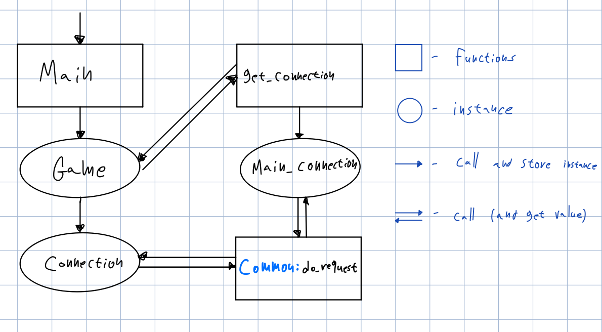

# Decumentation

### Playing
1. Decide if running `source code` or `exe` files  
    * For running `exe`, [download files here](https://drive.google.com/drive/folders/15UkXWRT1hTNS0HSgRaINdK-7Nt6SeYTH?usp=sharing), then double click either `server.exe` or `client.exe`.
    * For running source code, read `README` on project's root.
2. Run the server, should look like this  
  
3. Run client (up to 2 at the same time)
    * Will decline more than 2 clients at the same time
     
    * Playing the client is pretty straight forward, can quit before the bet or at end of deck, **should do it that way because then the server will free the port**.  
    
### Design
Here I'll explain the code and the design pattern I chose
* **Source tree**  

  * **`client`, `common`, `server`**  
  Independent python projects, `client` depends on `common` and `server` depends on `common`
  * **`dist`**  
  Has the exe files
  * **`documentation`**  
  Has the files for this decomentation you're reading
  * **`socket_project.egg-info`**  
  Folder in `.gitignore`, created by `setup.py` for easy development [(more on `setup.py` here)](https://docs.python.org/3.8/distutils/setupscript.html).
* **Design**
  * **Client**  
    * **Source tree**  
    
    * **Structure**  
      
      * **`Game`**  
      Has only connection instance, all data of amount, bets, cards and received from server and is not stored after displaying to the user.  
      * **`Connection`**  
      Has only one function and that is `do_request`, the instance `Game` has is created by `get_connection` which uses own internal connection called `_main_connection`.
    * **Validation**  
    Runs on client, but also on server to prevent hacking
  * **Server**  
    * **Source tree**  
    
    * **Structure**  
    
      * **`Game`**  
      All game logic, stores `amount` at start, has function such as `set_bet`, `tie_break` and stores all data for each round for `ClientManager` to get and return to the client.
      * **`ServerManger`**  
      Listens on main port, creates client managers when new connection is accepted, on termination will also terminate all clients.
      * **`ClientManger`**  
      Listens on any free port and will manage the connection to specific client.
    * **Validation**  
    All throws will return response with `rejection` type and the Exception message, no other data is sent so client just restarts the game (wasn't asked for, but nice feature against hacking).
  * **Common**  
    * **Source tree**  
    
    * **Structure**  
      * **`card`**  
      Card Class, has enums for all suits and ranks, encoding and decoding function for sending over socket, and many more.
      * **`client_api`**  
      Just enum to be used in `Server:ClientManager` and `Client:server_api` client manager will navigate to the asked api call from each client. 
      * **`event`**  
      Has `listen` and `do_request` functions, each will get `handler` with the response/request when the async call is received.   
      * **`PortManager`**  
      Has Main port, also manages what ports are free and taken, gives and releases free ports.  
      * **`Response`**  
      Shared with client and server to agree on "protocol" and how response should look and behave.  

